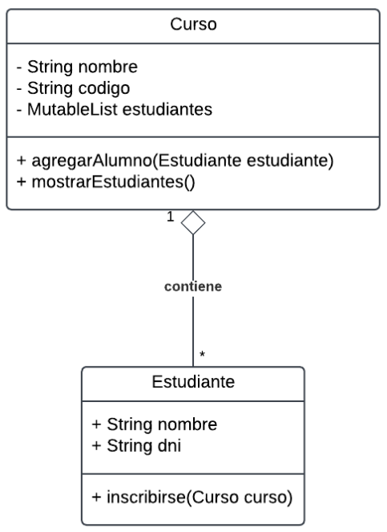

# Práctica 5.1

## 1. Interpreta el significado del diagrama de clases.

### a) Relación entre las clases. Significado, tipo, multiplicidad.

- **Significado**:  
  La relación entre las clases es una **agregación**, que significa que una clase (contenedora) está relacionada con otra clase (contenida) en una estructura de "parte-todo". Sin embargo, las partes (la clase contenida) pueden existir independientemente del todo (la clase contenedora).

- **Tipo de clase**:  
  Agregación.

- **Multiplicidad**:  
  Uno (1) a muchos (*).

---

### b) Elementos de las clases. Tipos y propósito.

#### Clase `Curso`:
- **Atributos**:
  - `String nombre`: Representa el nombre del curso. Es de tipo `String` para almacenar texto.
  - `String codigo`: Código único que identifica al curso. También es de tipo `String`.
  - `MutableList estudiantes`: Una lista mutable que almacena los estudiantes inscritos en el curso. Representa la relación de agregación con la clase `Estudiante`.

- **Métodos**:
  - `agregarAlumno(Estudiante estudiante)`: Método para añadir un estudiante a la lista de estudiantes del curso.
  - `mostrarEstudiantes()`: Método que muestra información de todos los estudiantes inscritos en el curso.

#### Clase `Estudiante`:
- **Atributos**:
  - `String nombre`: Nombre del estudiante. Es de tipo `String` para almacenar texto.
  - `String dni`: DNI del estudiante. Se usa para identificar al estudiante de forma única.

- **Método**:
  - `inscribirse(Curso curso)`: Método que permite al estudiante inscribirse en un curso determinado.

---

### c) Significado del método `agregarAlumno()` y su funcionamiento.

#### **Significado**:  
El método `agregarAlumno(Estudiante estudiante)` se encuentra en la clase `Curso`. Su objetivo principal es añadir un objeto de tipo `Estudiante` a la lista interna de estudiantes (`MutableList estudiantes`) que pertenece al curso. Este método implementa la lógica para gestionar la relación de agregación entre `Curso` y `Estudiante`.

#### **Funcionamiento**:
1. **Recibe un estudiante como parámetro**:  
   El parámetro es un objeto de la clase `Estudiante` que se desea agregar a la lista.

2. **Agrega al estudiante en la lista interna**:  
   Se utiliza el atributo `MutableList estudiantes` del curso para almacenar el objeto estudiante. El método debe incluir validaciones, como verificar que el estudiante no esté ya inscrito en el curso.

3. **Actualiza el estado del curso**:  
   Al agregar un estudiante a la lista, el curso refleja que ahora contiene más estudiantes inscritos.

---

### d) Significado del método `inscribirse()`.

#### **Significado**:  
El método `inscribirse(Curso curso)` pertenece a la clase `Estudiante`. Su propósito es permitir que un estudiante se inscriba en un curso específico, estableciendo así una relación entre el estudiante y el curso.

#### **Funcionamiento**:
1. **Recibe un curso como parámetro**:  
   El parámetro es un objeto de la clase `Curso` al que el estudiante desea inscribirse.

2. **Llama al método `agregarAlumno()` del curso**:  
   Internamente, el método utiliza el método `agregarAlumno` del curso para agregar al estudiante a la lista de estudiantes de ese curso.

3. **Refleja la inscripción del estudiante**:  
   Si es necesario, el método puede realizar otras tareas, como actualizar una lista interna de cursos en los que el estudiante está inscrito.

---

## 2. Generación de código a partir del diagrama.

### a) Crear clases.
### b) Crear relaciones.
### c) Crear `main` (para probar el sistema).

(ver /src)

